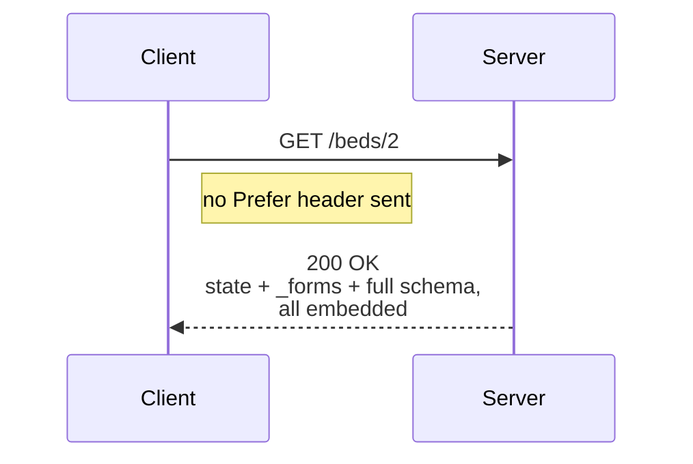
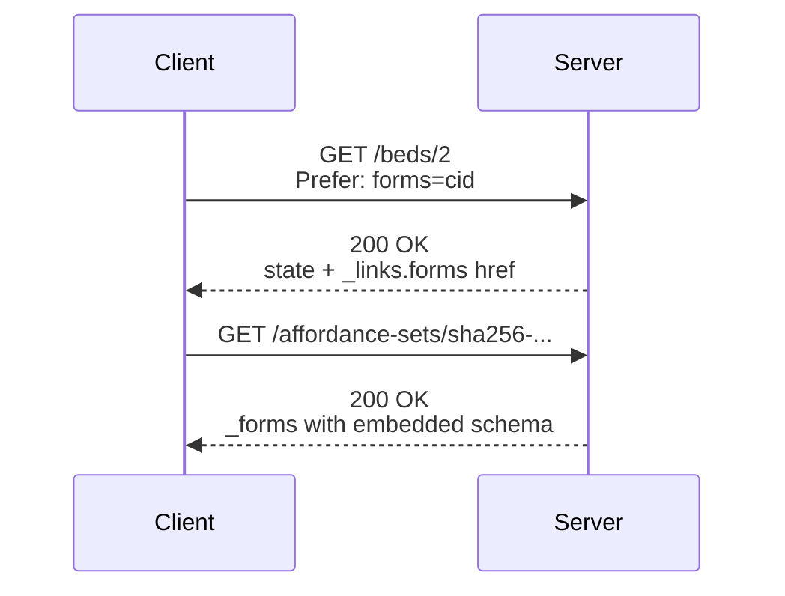
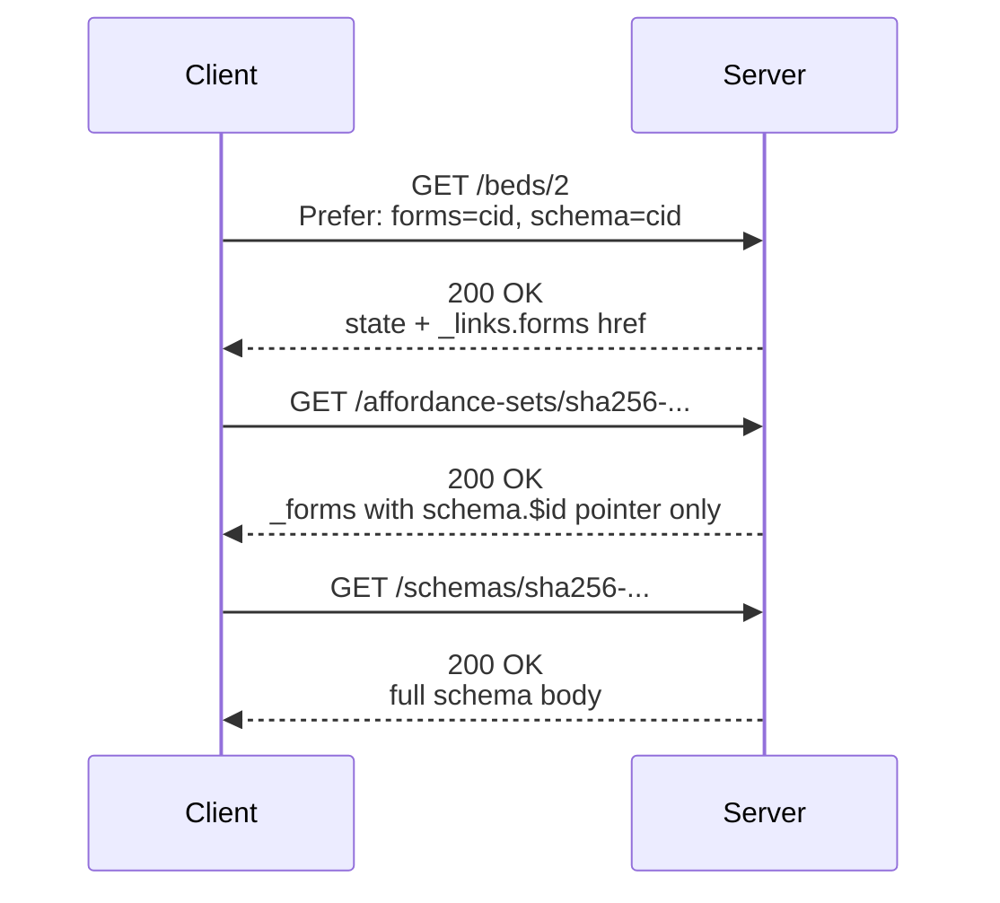
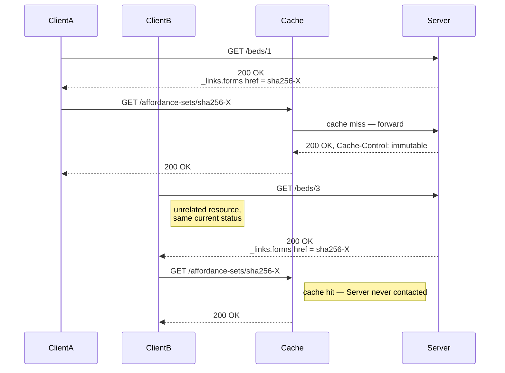
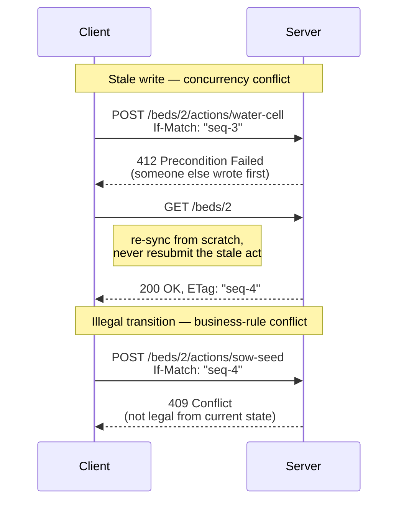
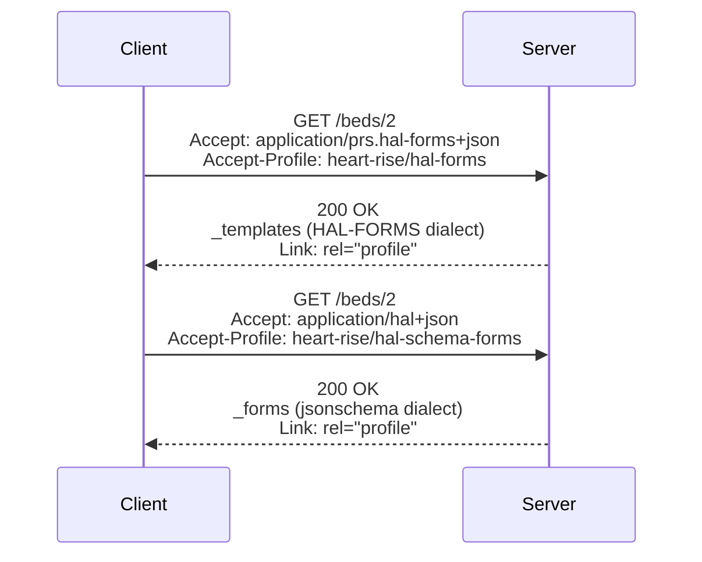
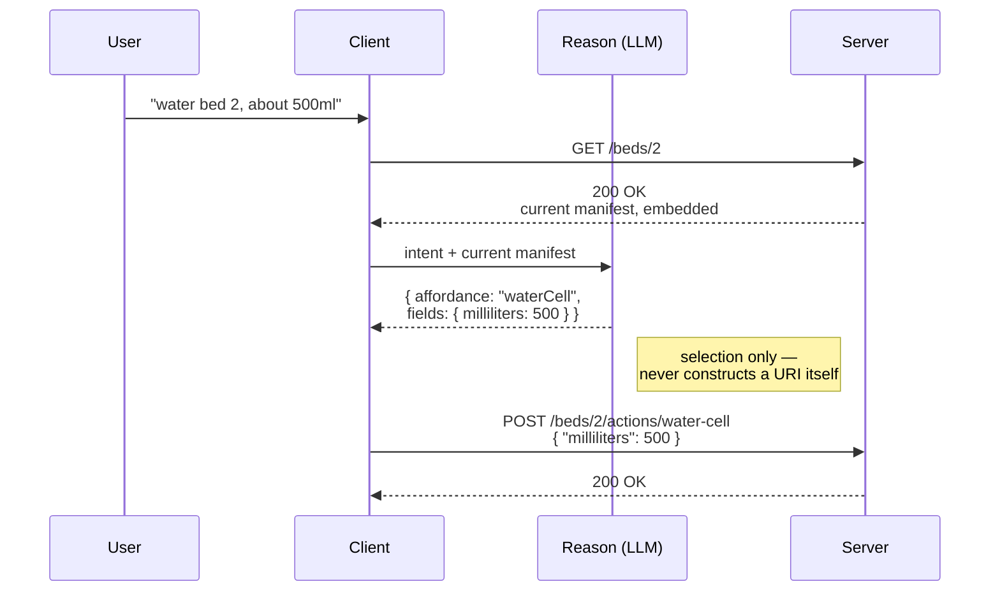

# H.E.A.R.T. + R.I.S.E. Protocol Suite
## With ARTIE Reference Client Implementation

**Version:** 0.4 — Working Draft
**Status:** §6.4–6.7 verified end-to-end against a live server (see ADR); remainder pre-implementation.
**Author:** Joshua Gough
**Date:** August 2026

**Changes since 0.3:**

- **Introduced the L0–L6 conformance ladder (§6.10)** as the normative structure for incremental adoption, with sequence diagrams per rung. L0 — everything embedded, zero headers — is an on-ramp, explicitly *not* conformance (§6.10.1).
- **Inverted the `Prefer` mechanism (§6.4).** Embedded is now the silent default; layering is opt-in via `Prefer: forms=cid` and `Prefer: forms=cid, schema=cid`. 0.3's `Prefer: embed=schemas` is withdrawn. This makes the bare-bones client the zero-configuration case and reverses which party bears the burden of understanding the layering.
- **Reworked the error model (§6.2)** around optimistic concurrency: `412` for a stale write against `If-Match`, `409` for a transition illegal from the current state. 0.3 used `409` for "resource moved" and `403` for business-rule prohibition; the ladder's L4 semantics supersede both. `428` is *restored* with its RFC 6585 meaning — the act was sent unconditionally — rather than deprecated.
- **Required conditional acts (§6.3, §6.8).** A client SHALL send `If-Match` carrying the Layer 1 `ETag` on every state-changing transition.
- **Separated Reason from Act normatively (§6.8, §6.10.7).** Inference emits a selection only; deterministic client code resolves the target URI, expands any template, and attaches the precondition. The LLM never constructs a URI.
- Corrected all HTTP caching references from RFC 7234 to **RFC 9111** (7230–7235 were obsoleted by 9110–9112 in 2022). Added normative references for `immutable` (RFC 8246), `412`/`If-Match` (RFC 9110), `428` (RFC 6585), URI Templates (RFC 6570), and Web Linking (RFC 8288). New §14.
- Rewrote the MCP characterisation in §3.1 and §8.1 against the **2026-07-28 specification**, which removed the `initialize` handshake and the protocol session entirely. The 0.3 claim that agents load tool definitions "during session initialization" no longer describes MCP.
- Added **tool search / deferred tool loading** as prior art (§8.4) — by 2026 this, not naive spec-in-prompt, is the baseline a reader will compare against.
- Reframed the central claim around **instance-and-state-scoped affordances** (§3.4, §8.4, §10). Rewrote §10's metrics: the precondition-sensitivity eval replaces the tautological "zero calls to absent affordances" metric, and the 90% token target is withdrawn as unsupportable against a cached, deferred-loading comparator.
- New **§6.9**: affordance target URIs, the sharing property, and content-addressed hygiene. URI Templates remain **MAY**, per author direction; §6.9 documents what each choice costs, including the confidentiality consequences of concrete hrefs in `public, immutable` bodies.
- Clarified that `Vary` applies to **Layer 1 only**, now including `Prefer` in the field-list.
- Corrected the RISE rel-name vocabulary to conform to **RFC 8288** (§7.5); renamed `template-hash` to `template-schema` (§7.2).
- Flagged `profile` as an **unregistered media-type parameter** and the `forms`/`schema` tokens as unregistered `Prefer` tokens (§6.1, §6.4).
- Corrected §13: Fielding's six REST **constraints** and the six 2008 **API rules** are different lists. 0.3 conflated them and dropped "no typed resources."

**Amendments in this revision (profile negotiation, aligned to W3C Content Negotiation by Profile, WD 03 July 2026):**

- **Dropped the media-type `profile` parameter entirely (§6.1).** Per connegp §6.1.1, that parameter is reserved for profiles specific to one media type (JSON-LD's expanded/flattened being the working example); `heart-rise` spans two media types and doesn't qualify. Replaced with `Accept-Profile` (request) and `Link: rel="profile"` (response, now normative — §6.2), per connegp's HTTP Headers Functional Profile.
- **Minted composite profile URIs (§6.1).** connegp's negotiation model is built for *alternatives* (ranked by q-value or profile hierarchy), not for two independent profiles holding simultaneously. Sending `Accept-Profile: <hal-schema-forms>, <heart-rise>` as a pair asks for one-or-the-other, not both-at-once — that isn't what we mean. `heart-rise/hal-schema-forms` and `heart-rise/hal-forms` are now the two atomic, negotiable profile identifiers, each a connegp-style narrower profile of the bare `heart-rise` family URI. This mirrors connegp's own worked example (§7.3.2, GeoDCAT-AP/StatDCAT-AP both profiling DCAT-AP).
- **Moved `behaviour`/`domain` to `Prefer` tokens (§6.4)**, off the retired `Accept-Profile; param:` syntax, since `Accept-Profile` is reserved for profile URIs and q-values only (connegp §8.2.2) and has no parameter extension point.
- **Withdrew the overclaiming in 8.6/§13.** Both `Accept-Profile` and response-side `Link: rel="profile"` rest on pre-Recommendation, and in `Accept-Profile`'s case pre-*submission*, foundations (§14) — connegp's own §13.2 lists the response-side header mechanism as a **Feature at Risk**. "Strict Fielding compliance" overstated this; corrected to describe the choice as the best current standards-track option rather than a settled one.
- **Flagged the `Prefer`/conneg tension (§8.7).** RFC 7240, as connegp §6.1.3 notes, explicitly advises against using `Prefer` for content negotiation — advice we followed for profile selection (hence the move to `Accept-Profile`) but not for the rendering ladder, which is still `Prefer`-based. The asymmetry is now stated rather than left implicit.

**Open editorial questions are marked `[AUTHOR]` inline.**

---

## 1. Executive Summary

This document defines the requirements for the H.E.A.R.T. (Hypermedia Enforced Agentic Reliable Transactions) and R.I.S.E. (Reciprocal Interface for State Exchange) protocol suite, together with ARTIE (Autonomous Restful Traversal and Interactive Engine), the reference client implementation.

The suite addresses an architectural gap in the current agentic AI landscape: agents select actions from a catalogue of what a system can do *in principle*, rather than from the set of transitions legal for *this resource, in its current state*. The catalogue may be static (an OpenAPI document in the prompt), dynamically retrieved (tool search), or dynamically discovered (MCP capability discovery) — in every case its granularity is the server or the tool library, never the resource instance. Preconditions are therefore discovered by attempting a transition and being refused.

H.E.A.R.T. moves the precondition into the affordance set itself. A resource's representation carries, or links to, the exact set of transitions currently permitted on it; the absence of an affordance is the enforcement, not an omission. This is Roy Fielding's uniform interface and hypermedia-as-the-engine-of-application-state constraint applied to agent-to-system and system-to-system integration.

Adoption is incremental by design. The **conformance ladder** (§6.10) defines seven rungs, from a single-hop response with everything embedded and no headers at all, through content-addressed layering and shared caching, to error semantics, cross-dialect negotiation, and optional LLM-driven selection. A server can climb it one rung at a time, and each rung is independently demonstrable rather than only meaningful once the whole stack is present.

---

## 2. Vision

A generic agent — one carrying no domain-specific knowledge — enters a system with a single URI and a known media type. The server responds with the current state of the world and the complete map of what is permitted right now, for this resource. The agent reasons over that map, maps user intent to available affordances, and executes a transaction constrained entirely by the server-provided schema. The domain-knowledge layer of the context window remains flat. The server can evolve freely. The agent adapts at the next sync cycle.

The same agent, without code changes, can interact with a garden management system, a basketball scoring system, an insurance claims system, or any other domain — because the agent is coupled to the **media type**, not to the domain.

The simplest possible client — one that sends no headers and follows no pointers — still gets a usable answer on the first hop. It forgoes the caching and sharing properties, but it is not shut out. This is the web's original design applied to the agentic era, and the web's original design did not require a client to be sophisticated in order to be served.

---

## 3. Problem Statement

### 3.1 The Current State

Agentic AI systems in 2026 are overwhelmingly built on one of three patterns:

**Pattern A — Static schema in context.** The agent is provided with an API schema before any interaction with the server. The schema lives in the system prompt or in a tool definition file. The agent constructs requests from this prior knowledge. When the server evolves, the schema must be updated, the agent redeployed, and the context reloaded.

**Pattern B — Retrieved tool definitions (tool search, deferred loading).** Tool schemas are indexed and retrieved just-in-time by semantic similarity to the model's current reasoning trajectory, rather than pre-loaded. This is a substantial improvement on Pattern A in both context economy and selection accuracy (§8.4). The retrieval index is nonetheless a catalogue of *what exists*: it is built from the tool library, and it has no representation of the state of any particular resource.

**Pattern C — Capability discovery protocols (MCP).** MCP provides standardised discovery via `tools/list`, with servers advertising whether they support dynamic list-change notification. The 2026-07-28 specification removed the `initialize`/`initialized` handshake and the protocol-level session; protocol version and client capabilities now travel per-request, and an optional `server/discover` method lets clients fetch capabilities when they want them up front. Discovery is therefore no longer tied to session initialisation, and MCP's stated direction — stateless, cacheable, routable — is convergent with the architecture described here.

> **Note on 0.3.** The previous draft asserted that MCP agents load tool definitions "during session initialization or server connection." That mechanism no longer exists. The distinction H.E.A.R.T. draws is not about *when* discovery happens; it is about *what discovery is scoped to*. See §3.4.

### 3.2 The Consequences

**Precondition discovery by refusal.** When the candidate set is scoped to the server or the tool library, transitions that are illegal for the current resource state remain selectable. The model chooses one, the server refuses it, and the agent learns the precondition by violating it. Each such round trip costs a request, a turn, and — in interactive deployments — user trust.

**Structural hallucination.** When the agent constructs requests from prior schema knowledge rather than server-provided affordances, it operates on potentially stale information. Field names change. Endpoints move. Business rules evolve. The agent guesses, and constructs plausible-but-invalid requests.

**Brittleness.** Server evolution requires client redeployment, with the coordination overhead, versioning complexity, and breaking changes that follow.

**Context rot.** Conversation history accumulates across turns. The domain-knowledge layer, if it is a static catalogue, never reflects the current state and must be reasoned around rather than reasoned from.

**Adoption cliff.** A protocol that is only useful once fully implemented is a protocol that does not get implemented. Any correction to the above must be adoptable one step at a time, by a team that cannot stop shipping to rewrite its API. §6.10 is the answer to this consequence, and it is as load-bearing as the others.

### 3.3 The Root Cause

Fielding named it in 2008: if the engine of application state is not being driven by hypertext then it cannot be RESTful. The industry built APIs that are not RESTful in this sense. It then built agents on top of those APIs and compounded the problem.

The root cause is the absence of a media type that binds resource state to the transitions currently legal *on that resource*, with schema constraints, discoverable at runtime from the server's response alone.

### 3.4 The Distinguishing Claim

The claim H.E.A.R.T. makes, and the one against which it should be evaluated, is narrow and specific:

> **Affordance sets are scoped to (resource instance, state, time). Tool catalogues — static, retrieved, or discovered — are scoped to the server or the library.**

The difference is not context size. Tool search already achieves large context reductions with accuracy *gains* (§8.4); H.E.A.R.T. should not be sold as a better compression scheme, because on that axis alone the case is weak and getting weaker.

The difference is that **absence carries information**. Under Patterns A, B, and C the candidate set answers *what can this system do*, and the model may select a transition that is well-formed, semantically apt, and illegal for this instance right now. Under H.E.A.R.T. that transition is not in the candidate set, because the server did not put it there. The precondition is enforced at selection time rather than discovered at submission time.

This has a cost, and the document should be read as accepting it: a manifest that varies with state is a manifest that changes between turns, and anything that changes between turns invalidates a cached prompt prefix (§6.8, §10.1). A prefix that never changes is a prefix that is not tracking state. That is the trade being made, deliberately.

---

## 4. Goals

- Define a media type layered into resource state, affordance set, and schema, deliverable either collapsed or as separately-addressed layers
- Define compliant server behaviour that enforces business rules through affordance presence and absence
- Define compliant client behaviour that enters with a bookmark and discovers everything at runtime
- Define a content-addressing procedure for affordance sets and schemas, with a canonical computation procedure
- Define a caching model, built on standard HTTP semantics (RFC 9111), that eliminates redundant schema fetches
- **Define a conformance ladder that makes partial adoption meaningful, demonstrable, and honestly labelled**
- Define the Sync-Reason-Act cycle as the agent's processing model, including the rung-dependent sync walk
- Support two base hypermedia-forms dialects (HAL Schema Forms and HAL-FORMS) from one shared source of truth
- Define the RISE envelope pattern for asynchronous reciprocal interaction, with push and poll callback modes
- Define a content negotiation mechanism (`Accept` for dialect, `Prefer` for layering) that defaults to the simplest client
- Produce a reference implementation — ARTIE — that demonstrates every rung across two unrelated domains
- Demonstrate that a state-scoped affordance set reduces attempted-illegal-transition rate against a tool-search baseline on preconditioned tasks (§10.2)
- Demonstrate per-turn token cost against an honestly-specified baseline (§10.1)

---

## 5. Non-Goals

- Retrofitting existing non-compliant APIs
- Replacing AsyncAPI, OpenAPI, gRPC, or MCP in their existing use cases
- Defining a general purpose agent framework
- Solving hallucination in the semantic reasoning step — H.E.A.R.T. constrains structural hallucination only
- Explaining *why* an affordance is absent (see §12 — models reason poorly from absence, and this is a known open edge)
- Prescribing server implementation technology
- YAML and Markdown serialisation profiles (deferred to V2)
- Authentication and authorisation mechanisms — but note that §6.9.4 imposes a caching-confidentiality requirement that is not optional, because it arises from the caching design itself rather than from an access-control policy
- Rate limiting and throttling
- Multi-agent coordination beyond two-party RISE

---

## 6. Protocol Requirements

### 6.1 Media Type, Dialects, and Profile Negotiation

H.E.A.R.T. is a layer over a base hypermedia-forms dialect, not a single fixed media type. Two base dialects are recognised, selected by ordinary HTTP content negotiation (`Accept`). Conformance to the `heart-rise` profile is negotiated **entirely independently of the media type**, using `Accept-Profile` (request) and `Link: rel="profile"` (response), per the W3C *Content Negotiation by Profile* Working Draft, 03 July 2026 (henceforth "connegp"; §6.1.1 and §7).

**Profile identifiers are composite, not conjunctive.** `heart-rise` never stands alone on the wire. It is always layered over exactly one base dialect, and connegp's negotiation model (§7.3.2) is built for a client to request *one profile from a set of alternatives*, ranked by preference — not for two independent profiles to apply to a response simultaneously. Sending `Accept-Profile: <hal-schema-forms>, <heart-rise>` would ask for either one, which is not what's meant. Accordingly, 0.4 mints one atomic profile URI per (dialect, `heart-rise`) pair:

- `https://github.com/jogoshugh/heart-rise/hal-schema-forms`
- `https://github.com/jogoshugh/heart-rise/hal-forms`

The bare `https://github.com/jogoshugh/heart-rise` URI remains as the family/parent identifier — analogous to connegp's own worked example where GeoDCAT-AP and StatDCAT-AP are each a narrower `prof:Profile` of DCAT-AP without profiling each other (connegp §7.3.2, Example 7; §A.2). It is never sent in `Accept-Profile`, since alone it does not fully constrain a wire format; a server MAY include it alongside the concrete profile in a `Link: rel="profile"` response for hierarchy discoverability.

**HAL Schema Forms dialect** (`https://github.com/jbadeau/hal-schema-forms`):
```
Accept: application/hal+json
Accept-Profile: <https://github.com/jogoshugh/heart-rise/hal-schema-forms>

---

HTTP/1.1 200 OK
Content-Type: application/hal+json
Link: <https://github.com/jogoshugh/heart-rise/hal-schema-forms>; rel="profile"
```
Uses the `_forms` key. Full JSON Schema per field.

**HAL-FORMS dialect** (Amundsen's `application/prs.hal-forms+json`, the format Spring HATEOAS and other toolchains already ship natively):
```
Accept: application/prs.hal-forms+json, application/hal+json;q=0.5
Accept-Profile: <https://github.com/jogoshugh/heart-rise/hal-forms>

---

HTTP/1.1 200 OK
Content-Type: application/prs.hal-forms+json
Link: <https://github.com/jogoshugh/heart-rise/hal-forms>; rel="profile"
```
Uses the `_templates` key. Amundsen's inline `properties` array (`name`, `type`, `required`, `readOnly`, etc.), not JSON Schema.

> **Why not a media-type parameter.** connegp §6.1.1 reserves the `profile` media-type parameter for profiles specific to *one* media type (its worked example is JSON-LD's expanded/flattened forms), and records that DXWG and the JSON-LD WG concluded exactly this at TPAC 2018. `heart-rise` spans two unrelated media types, so it does not qualify, and 0.3/early-0.4's `Accept: application/hal+json;profile="..."` was a private extension of a parameter that was never ours to use this way — in tension with §13's "no private protocol extensions." This revision drops it entirely in favour of `Accept-Profile`/`Link: rel="profile"`, connegp's mechanism for media-type-independent profiles.

> **Standards footing — read before treating any of the above as settled.** This is the best available standards-track mechanism for the problem, not a finished one. connegp itself is a Working Draft, not a Recommendation, and its own §13.2 lists response-side profile signalling via HTTP headers — the exact `Link: rel="profile"` mechanism just made normative below — as a **Feature at Risk**, meaning the W3C group has not committed to it surviving to Recommendation. `Accept-Profile` is in worse shape: connegp §6 (Related Work) states plainly that the header is the subject of a separate IETF Internet-Draft that "has not yet been submitted to the IETF" and is expected to be "completely re-written," and that connegp's own text describing it "should be seen as a work-in-progress until this paragraph is removed." See §14 and §8.6 for the full status, and §12 for what happens to this section if either foundation moves.

A server SHOULD support both dialects for the same resource, generated from one shared source of truth for "which affordances are currently legal" — the two dialects MUST NOT be allowed to drift into disagreeing about that. Dialect is an orthogonal axis to the layering ladder, not a rung above it (§6.10.6).

**`Vary` applies to Layer 1 only.** A server that varies its Layer 1 response by `Accept`, `Prefer`, or `Accept-Profile` SHALL send `Vary: Accept, Prefer, Accept-Profile` as applicable. Layer 2 and Layer 3 are content-addressed and therefore have exactly one representation each; they never negotiate, and SHALL NOT send `Vary`. Dialect, profile, and rendering are all baked into the bytes, and so into the address (§6.5). Layer 1 `ETag` values SHALL differ across dialects and across rungs, since these are different representations of that resource.

**The `heart-rise` profile is dialect-independent in substance, dialect-specific in identifier.** The layering model, content addressing, ladder, and Sync-Reason-Act cycle it adds are one shared set of semantics; connegp's negotiation model is simply what forces that one concept to be exposed as two concrete, negotiable URIs rather than one. It never replaces or modifies either base dialect's own structure; it only adds: the three-layer content-addressing model (§6.1, §6.5), `Prefer`-based layering negotiation (§6.4), the conformance ladder (§6.10), and the Sync-Reason-Act processing model (§6.8). A server already serving either base dialect can adopt H.E.A.R.T. compliance incrementally, one rung at a time, without changing its dialect's own wire format.

A H.E.A.R.T. response is organised into three layers. Whether those layers arrive collapsed into one response or as separately-addressed resources is determined by the client's `Prefer` header (§6.4) and by the rung the server has reached (§6.10):

| Layer | Content | Identity when separate | `Cache-Control` when separate | Revalidation |
|---|---|---|---|---|
| **1 — Resource** | Domain state, plus either the embedded affordance set or a link to it | Stable resource URL | `no-cache` | ETag every request; `304` if unchanged |
| **2 — Affordance Set** | The dialect's manifest (`_forms` or `_templates`) for the current state | Content-addressed URL: `sha256-{hash}` of the bytes actually served | `public, max-age=31536000, immutable` (but see §6.9.4) | None — the URL is proof of content |
| **3 — Schema** | Per-field definition for one affordance (JSON Schema, or a HAL-FORMS `properties` fragment) | Content-addressed URL, same scheme as Layer 2 | `public, max-age=31536000, immutable` | None |

`immutable` is RFC 8246. Support outside browser caches is uneven; the year-long `max-age` carries most of the benefit regardless, and the content address makes staleness meaningless by construction.

**Resource (Layer 1).** Domain data for the current state. SHALL be revalidated on every request (`ETag`/`If-None-Match`); this layer changes, so it is never content-addressed. It carries the affordance set either inline (L0) or by link (L1+).

**Affordance Set (Layer 2).** The complete set of transitions currently legal on the resource, in whichever dialect was negotiated. Each affordance entry SHALL contain, at minimum: a `rel`/name, a target `href` (which MAY be a URI Template — see §6.9), an HTTP method, and either an inline schema or a schema-by-reference pointer, depending on `Prefer` (§6.4).

> Whether a Layer 2 body is shared across resources in the same state, or minted per resource, follows entirely from the `href` choice. §6.9 sets out both profiles and what each costs. The L3 caching proof (§6.10.4) holds only under the templated profile.

**Schema (Layer 3).** The canonical per-field definition — full JSON Schema vocabulary for the HAL Schema Forms dialect, or Amundsen's `properties` fragment for the HAL-FORMS dialect. Each dialect's Layer 3 artifact is its own distinct content, independently content-addressed — a JSON Schema document and a HAL-FORMS properties fragment for the same field are not interchangeable representations of one canonical hash; they are two different, correctly different, addresses.

### 6.2 Compliant Server Behaviour

A H.E.A.R.T. compliant server SHALL:

- Serve L0, L1, and L2 renderings on request, per §6.4 and §6.10 — a server that can only produce the collapsed L0 rendering is **not compliant** (§6.10.1)
- Default to the L0 collapsed rendering when no `Prefer` header is sent
- Vary the affordance set based on current domain state
- Serve Layer 2 and Layer 3 at content-addressed URLs computed per §6.5, with `max-age=31536000, immutable` and the cacheability directive required by §6.9.4
- Serve Layer 1 with `Cache-Control: no-cache` and a correct `ETag`, honouring conditional requests with `304`
- Reject transitions not present in the current affordance set
- Require and honour `If-Match` on state-changing transitions (§6.3), responding `412` on mismatch and `428` when the precondition is absent
- Support `Accept`-based dialect negotiation (§6.1) and send `Vary` on Layer 1 per §6.1
- **Send `Link: <profile-uri>; rel="profile"` on every Layer 1 response, identifying which composite profile (§6.1) was actually served.** This is connegp R.1.2.a and is not optional: without it, a client that sent `Accept-Profile` has no way to confirm what it got, and a client that sent nothing has no way to discover that a profile applies at all. A server MAY additionally list the parent `heart-rise` URI in a second `Link: rel="profile"` for hierarchy discoverability (§6.1).
- Echo `Preference-Applied` when a `Prefer` token is honoured
- If serving both dialects, generate both from one shared source of truth for which affordances are currently legal — never two independently-maintained descriptions that could silently disagree

Business rules SHALL be enforced through affordance presence and absence. An action not present in the current manifest CANNOT be exercised. This is the primary mechanism for structural reliability.

**Error response codes (revised in 0.4).** The ladder's L4 rung (§6.10.5) draws a line 0.3 did not: *stale write* and *illegal transition* are different failures with different client handling, and collapsing them into one code destroys that distinction. A compliant server SHALL use:

| Code | Meaning in H.E.A.R.T. context | Client handling |
|------|-------------------------------|-----------------|
| 403 Forbidden | The principal is not permitted to act on this resource at all. Reserved for authorisation; not used for state-dependent business rules. | Do not retry. |
| 404 Not Found | The resource no longer exists. | Abandon; re-enter from bookmark. |
| 405 Method Not Allowed | Client used the wrong HTTP method for the given affordance. | Client defect. |
| **409 Conflict** | The transition is **not legal from the current state**. Either the resource moved since sync, or the client submitted an affordance absent from the current manifest. | Re-sync. The affordance may legitimately no longer exist. |
| **412 Precondition Failed** | `If-Match` mismatch — someone else's write landed first. The act is stale. | Re-sync from scratch. **SHALL NOT** resubmit the stale act; the intent must be re-derived against the new state. |
| 422 Unprocessable Content | Schema validation failure — required field missing or type mismatch. | Client or schema defect; do not retry unmodified. |
| **428 Precondition Required** | The state-changing request arrived without `If-Match`. | Re-issue conditionally. |

Notes on the changes:

- 0.3 used `409` for "resource moved between sync and act" and `403` for "business rules prohibit it in the current state." Both are now `409`, because from the client's position they are indistinguishable and demand the same response: re-sync. `403` is freed for authorisation, where it belongs.
- 0.3 deprecated `428` as having no remaining trigger. Making acts conditional gives it back its RFC 6585 meaning exactly — *this server requires the request to be conditional* — which is a better outcome than deletion. §12's recommendation to remove it is withdrawn.
- `422` is named "Unprocessable Content" in RFC 9110; 0.3's "Unprocessable Entity" is the older RFC 4918 name for the same code.

The critical distinction, and the one §6.10.5 exists to demonstrate: **412 means the world moved under a valid intent; 409 means the intent was never valid here.** A client that retries on 412 corrupts state. A client that treats 409 as transient loops forever.

### 6.3 Compliant Client Behaviour

A H.E.A.R.T. compliant client SHALL:

- Enter any interaction with a single bookmark URI and no prior domain knowledge
- Negotiate dialect via `Accept`, never via a H.E.A.R.T.-specific parameter (§6.1)
- Declare its rung by sending the corresponding `Prefer` tokens, or none at all (§6.4, §6.10)
- Rely on ordinary HTTP caching for Layer 2/3 — an RFC 9111-compliant cache is sufficient, with no fingerprint-comparison logic. A client operating at L0 or L1 SHALL NOT expect the caching properties of §10.5; they are a consequence of the rung it chose not to climb
- Expand URI Templates per RFC 6570 where a server supplies them, resolving variables from Layer 1 (§6.9.1)
- Always revalidate Layer 1 (send `If-None-Match` once an `ETag` is held)
- **Send `If-Match` carrying the current Layer 1 `ETag` on every state-changing transition**, and never submit an act derived from a manifest it has not revalidated in the current cycle
- Reason only over affordances present in the current affordance set
- Populate form fields within the constraints declared by the schema
- Never construct a URI from prior knowledge — including never guessing a content-addressed URL; it must come from a Layer 1 or Layer 2 link. Note that a content address is computable by anyone who can reconstruct the bytes, so this is a conformance rule, not a security property (§6.5, §6.9.5)
- On `409`, re-sync and re-derive intent before retrying. On `412`, re-sync and **discard the pending act**. On `428`, re-issue conditionally

### 6.4 Content Negotiation

H.E.A.R.T. uses three independent, standard HTTP mechanisms, one per orthogonal concern: `Accept` for dialect, `Accept-Profile` for `heart-rise` conformance (§6.1), and `Prefer` for layering and for the two behavioural signals below.

**`Accept` selects the dialect (§6.1). `Accept-Profile` selects the `heart-rise` composite profile (§6.1).**

**`Prefer` (RFC 7240) selects the layering — and the default is fully collapsed.**

This is inverted from 0.3, which made the pointer form the default and required `Prefer: embed=schemas` to collapse it. The inversion matters more than it looks:

- The zero-configuration client — no headers, no knowledge of content addressing, no cache — gets a complete, usable response on the first hop. It does not need to understand H.E.A.R.T. to be served by a H.E.A.R.T. server.
- The burden of understanding the layering falls on the client that *benefits* from it, which is the client sophisticated enough to have asked.
- A server that does not yet implement a rung ignores the corresponding token and returns the collapsed form, which the client can still use. Graceful degradation is inherent rather than bolted on: an unhonoured `Prefer` is not an error.

| Header sent | Layer 1 contains | Layer 2 contains | Hops | Rung |
|---|---|---|---|---|
| *(none)* | state + affordance set + full schemas | — | 1 | L0 |
| `Prefer: forms=cid` | state + link to affordance set | affordances with embedded schemas | 2 | L1 |
| `Prefer: forms=cid, schema=cid` | state + link to affordance set | affordances with schema `$id` pointers | 3 | L2 |
| `Prefer: schema=cid` | state + affordance set with schema pointers | — | 2 | permitted; see below |

`Prefer: schema=cid` alone is legal and a server MAY honour it: the affordance set stays inline in Layer 1 while its schemas become separately-addressed. This is useful where the set is small and volatile but the schemas are large and stable. It is not a named rung because it is a combination rather than a step, and ARTIE is not required to exercise it.

A server SHALL echo `Preference-Applied` listing the tokens it honoured. A client SHALL treat the absence of a token from `Preference-Applied` as meaning that layer arrived embedded, and SHALL NOT fail on it.

> **Registration status.** `forms`, `schema`, `behaviour`, and `domain` (below) are none of them in IANA's Preferences registry (which holds `respond-async`, `return`, `wait`, `handling`, `depth-noroot`). RFC 7240 permits unregistered preference tokens and requires that a server which does not understand one ignore it — which is precisely the degradation behaviour relied on throughout this section — but registration SHOULD accompany media type registration (§12).

> **Withdrawn: `embed=schemas` and the cache-seeding requirement.** 0.4's earlier draft required clients to seed their HTTP cache from embedded bodies, with content-address verification, because embedding was the opt-in and a client using it would never warm its cache. Under the inverted default this problem dissolves for conforming clients: a client that wants caching sends `forms=cid, schema=cid` and gets ordinary HTTP caching with no bespoke logic at all. Seeding is now permitted but never required, and a client that does seed SHALL still verify the content address over the received bytes before storing (§6.5) — an unverified seed would let a `no-cache` Layer 1 response poison a shared, year-long, immutable cache entry.

> **Tension with RFC 7240 §2, echoed in connegp §6.1.3.** RFC 7240 states that `Prefer` "is not appropriate for... content negotiation," and connegp's authors cite exactly that language as their reason for routing profile selection through `Accept-Profile` instead. 0.4 follows that advice for `heart-rise` conformance (§6.1) but not here: the rendering ladder is arguably also a content-negotiation choice — it selects which representation of the resource is returned — and it stays on `Prefer`. The distinction offered, not fully settled: profile selection changes *what the client can correctly interpret* and a wrong guess is a hard failure requiring a distinct response (`406`-equivalent), which is what `Accept`/`Accept-Profile` are built for; the ladder is softer — every rung is a valid, self-describing rendering of the same resource, an unhonoured token degrades to a still-usable L0 response rather than an error, and that soft-preference-with-graceful-fallback behaviour is exactly what `Prefer` is specified for. Recorded here rather than resolved, since RFC 7240's advice is explicit and the counter-argument is ours, not the standard's.

**Behaviour and Domain Signalling.** `Accept-Profile` is reserved by connegp for profile URIs and q-values only (§8.2.2); it has no parameter extension point, so the `param:behaviour=...` syntax used in 0.3 was never valid connegp and is withdrawn. These two signals move to `Prefer` tokens instead, alongside the layering tokens above:

```
Prefer: behaviour=autonomous, domain="https://example.org/vocab/farming"
```

| Token | Values | Effect |
|-----------|--------|--------|
| `behaviour` | `interactive` (default), `autonomous` | Signals whether a human is available to clarify ambiguous intent; servers MAY use this to omit affordances requiring disambiguation |
| `domain` | URI | Declares familiarity with a specific domain vocabulary; servers MAY omit explanatory metadata for known rel names |

Note that `behaviour=autonomous` changes which affordances the server emits, which changes the Layer 2 body, which changes its content address. Two clients differing only in `behaviour` see different Layer 2 URLs. That is correct and self-consistent, but it halves cross-client sharing and should be stated.

Graceful degradation SHALL be supported. A request with no negotiation headers at all SHALL receive a full, collapsed, dialect-defaulted response — this is L0 and is the floor of the system. A `406 Not Acceptable` SHALL be returned only when no acceptable dialect can be produced; connegp does not define an analogous failure code for an unsatisfiable `Accept-Profile`, and a server unable to produce any requested profile SHOULD fall back to its default profile per connegp §7.3.2 rather than fail the request.

### 6.5 Content Addressing

A H.E.A.R.T. content address is a deterministic identifier for the *actual bytes* of a Layer 2 or Layer 3 resource. All compliant implementations MUST use the same procedure to ensure interoperability.

**Algorithm:** SHA-256 over the full, minified, canonical JSON body — not a reduced structural projection. This is a deliberate change from 0.2, which hashed only a stripped `{fields, required}` projection so cosmetic changes would not invalidate the cache. That property is given up on purpose: a content address is only trustworthy — "this URL is proof the bytes beneath it cannot have changed" — if *any* byte difference produces a different address.

**Canonicalization:** JSON Canonicalization Scheme per RFC 8785 (recursively sorted keys, no insignificant whitespace) applied to the full body before hashing.

**Scope of "the body" for Layer 2 (revised in 0.4).** The hash is computed over **the bytes actually served at that address**. An L1 affordance set (schemas embedded) and an L2 affordance set (schema pointers) are different bytes and therefore have **different addresses**, both immutable, both correct.

This reverses 0.3's rule that a Layer 2 resource has one canonical address regardless of rendering, computed over the never-embedded form. That rule cannot survive the ladder: if two renderings shared one address, then an L1 client's cached copy and an L2 client's cached copy would be different content under the same immutable URL, and whichever arrived first would be served to the other. The address would no longer determine the content, which is the only property content addressing exists to provide. The alternative — making the affordance-set URL `Vary` on `Prefer` — abandons the same property while adding a cache-key dependency that shared caches implement inconsistently.

The cost is that L1 and L2 clients do not share affordance-set cache entries. They still share all Layer 3 entries, and each shares fully with its own rung. Given that a deployment will typically standardise on one rung, this is a small loss for a large gain in integrity. `[AUTHOR]` — confirm; this is the one place where 0.4 overturns a stated 0.3 property rather than clarifying it.

**Scope of "the body" for Layer 3:** the schema's own raw content, verbatim.

**Output:** Lowercase hexadecimal digest, used directly as the final URL path segment: `/affordance-sets/sha256-{digest}`, `/schemas/sha256-{digest}`.

**Digest truncation.** A server MAY truncate the digest for readability (e.g. 16 hex characters). The 0.3 text framed this as a straight readability/collision trade, which understates it. Under content addressing a collision does not merely waste a cache slot — it causes the wrong schema to be served under a URL another party's content minted, silently. At 64 bits, birthday collisions become practically reachable at scale, and second-preimage resistance is entirely absent against any party who can influence schema content. Truncated digests are acceptable **only** for closed-world development and demonstration servers where all content is authored by one trusted party. Production servers SHALL use the full digest.

**Content addresses are not capability URLs.** A content address is a pure function of content. Anyone who can reconstruct the bytes can compute the URL without ever having been shown it, and a `200` on a speculatively-computed address confirms that content exists on that server. Content-addressed URLs SHALL NOT be treated as unguessable, and SHALL NOT be used as bearer capabilities. §6.9.4 and §6.9.5 set out what follows.

Implementations producing different addresses from byte-identical content are non-compliant.

### 6.6 Caching

There is no bespoke client-side affordance registry keyed by fingerprint. Layer 2 and Layer 3 caching is standard HTTP: any RFC 9111-compliant cache correctly caches content-addressed URLs for the full `max-age`, with zero H.E.A.R.T.-specific logic. A client SHOULD use a persistent HTTP cache to carry this benefit across sessions, exactly as for any other immutable static asset.

Caching is a property of the rung. At L0 nothing is cacheable — the whole response is `no-cache` Layer 1 — and that is the price of the on-ramp. At L1 the affordance set is cacheable but its schemas are not independently so. Only at L2 does the full model apply. §10.5 measurements SHALL state the rung they were taken at.

One piece of genuine client-side state remains, unrelated to caching:

**Agent directory.** Maps rel name to agent endpoint URI. Populated from affordances with the `heart:agent` rel (§7.6). Used by RISE fallback selection. This is a real client-side registry — not a cache, but a directory of known agents.

### 6.7 Sync Behaviour

The sync step is the first step of every Sync-Reason-Act cycle. Its shape depends on the rung the client operates at (§6.10):

**At L0** sync is a single fetch. Layer 1 arrives with everything embedded, and the cycle proceeds.

**At L1 and L2** sync is a walk. The sync step SHALL:

- Fetch Layer 1 (always revalidated; expect `304` if state has not changed)
- Follow Layer 1's link to Layer 2 — a normal GET, satisfied from the HTTP cache if this exact content-addressed URL was seen before, from the network otherwise
- At L2, for each affordance needing its schema, follow the Layer 3 pointer — likewise cache-or-network, fetched in parallel since none depend on each other
- Deduplicate by URL before fanning out — two affordances sharing one schema URL MUST NOT both trigger a network request; resolve to one in-flight fetch per unique URL
- Complete with zero additional network requests for any Layer 2/3 URL already held in cache

At every rung, the agent SHALL NOT reason until the affordance set is fully resolved, and SHALL retain the Layer 1 `ETag` for use as the `If-Match` precondition in the Act step.

A `304` on Layer 1 proves the Layer 1 representation is unchanged, which includes the affordance-set link. Since that link is a content address, an unchanged link is an unchanged affordance set. Servers SHALL therefore compute the Layer 1 `ETag` over a representation that includes the affordance-set link, so this inference holds.

### 6.8 Sync-Reason-Act Cycle

**Sync.** Walk the layers appropriate to the rung (§6.7). The agent SHALL NOT reason until the affordance set is fully resolved.

**Reason.** Map user intent to available affordances using the rel names as semantic anchors. The LLM SHALL operate only on affordances present in the current manifest. When intent is ambiguous or no affordance matches, the agent SHALL seek clarification rather than guess.

**Act.** Deterministic client code — not the model — resolves the target URI, expands any URI Template (§6.9.1), attaches `If-Match` from the Layer 1 `ETag`, and submits. Receive the next resource state and manifest. Restart the cycle.

**Reason and Act are separated normatively.** The Reason step's entire output is a *selection*: an affordance name and a set of field values, validated against the declared schema. It SHALL NOT emit a URI, a method, a header, or a precondition. Everything between the selection and the wire is deterministic. This confines inference to one step with a closed output space, and is what makes §10.3's structural-hallucination claim checkable rather than aspirational — a model that cannot express a URI cannot hallucinate one. §6.10.7 demonstrates the boundary.

**Context window scope.** The H.E.A.R.T. constraint applies to domain knowledge, not to conversation history. The current resource state and manifest SHALL be present in the context window. Conversation history is managed by the agent framework separately.

**Prompt-cache stability.** The manifest changes as state changes — that is the point (§3.4) — and any change to a cached prompt prefix invalidates it and everything after it. Providers charge cache reads at a large discount relative to fresh input, so an agent that places its manifest high in the prompt will pay full price for its entire prefix on every transition and can plausibly cost *more* per turn than a static cached catalogue.

A compliant agent implementation SHALL therefore:

- Place the resource state and manifest at the **end** of the cacheable region, below the system prompt, tool definitions, and any stable instructions, so that manifest churn invalidates only the manifest
- Hold everything above the manifest byte-stable across turns — no timestamps, no session identifiers, no re-ordered content
- Report cache-read and cache-write token counts separately in any §10.1 measurement

### 6.9 Affordance Target URIs, the Sharing Property, and Content-Addressed Hygiene

*This section resolves the `href` question. §6.1 keeps `MAY` — both profiles below are conformant. What differs is what each one costs, and a server author needs to choose knowingly rather than by default.*

#### 6.9.1 Two conformant profiles

**Templated profile.** Affordance `href` values are RFC 6570 URI Templates whose variables are resolved by the client from Layer 1 — typically the resource identifier and any path context. The Layer 2 body contains no instance identity. Where a server uses templates it SHALL restrict itself to RFC 6570 **Level 1** (simple string expansion) unless it declares otherwise, and SHALL name variables such that every variable is resolvable from the Layer 1 representation the client already holds; a template referencing a variable the client cannot resolve is non-compliant. Expansion is performed by deterministic client code, never by the Reason step (§6.8).

**Concrete profile.** Affordance `href` values are fully-resolved URIs containing instance identity. The Layer 2 body is specific to the resource that produced it.

#### 6.9.2 The sharing property holds only under the templated profile

§6.1 and §6.10.4 describe an affordance set shared across resources in the same state — two unrelated resources pointing at one URL, fetched once. That property is a *consequence of templating*, not of the layering.

Under the templated profile, the Layer 2 body is a function of `(state, dialect, rung, behaviour)`. Every resource in that state canonicalises to identical bytes, hence one address, hence one fetch. Cardinality is bounded by the state machine.

Under the concrete profile, the body is additionally a function of the resource. Every resource mints its own address in every state it passes through. Cardinality is `resources × states` and unbounded in the resource dimension. Cross-resource cache reuse is exactly zero — the warm-cache steady state still holds *within* a single resource's repeated visits to a state, which is a real benefit, but the "two unrelated resources, one fetch" claim is false, and the L3 proof (§6.10.4) cannot be demonstrated.

**Layer 3 is unaffected.** Schemas are addressed by their own content and contain no hrefs, so they are shared under both profiles. A server on the concrete profile still gets full schema-level sharing at L2; it loses affordance-set-level sharing only.

Servers on the concrete profile SHOULD additionally consider that `immutable, max-age=31536000` on an unbounded address space is a storage commitment. Content-addressed resources cannot be invalidated, only forgotten, and any CDN in front of the server will retain them for the stated year.

#### 6.9.3 The L3 caching proof is profile-conditional

The cross-resource sharing verification (§6.10.4, §9.3) is a valid conformance test **only against a templated server**. Against a concrete server the correct expectation is the opposite: two resources in the same state resolve to two distinct Layer 2 addresses and two fetches, with shared Layer 3 fetches beneath them at L2. The simulation suite SHALL run both profiles and assert the profile-appropriate outcome in each, and ARTIE SHALL be demonstrated correct against both. A test suite that asserts sharing unconditionally will report a conformant concrete server as broken.

#### 6.9.4 Confidentiality: the concrete profile changes the required `Cache-Control`

This is the consequence that is not merely economic.

Under the concrete profile, instance identifiers sit inside a body that §6.1 directs the server to serve as `public`. Two things follow, and both are properties of the caching design rather than of any authorisation policy — which is why §5's exclusion of auth does not cover them:

1. **Shared caches store it.** `public` authorises any intermediary — CDN, corporate proxy, ISP cache — to store and re-serve that body for a year. It now contains identifiers for resources belonging to particular principals or tenants.
2. **The address is an existence oracle.** A content address is computable from content (§6.5). An attacker who can guess an identifier and knows the state machine can construct the candidate Layer 2 body, canonicalise it, compute the address, and issue a `GET`. A `200` confirms that this identifier exists in that state. No authentication is involved, because content-addressed layers are unauthenticated static assets by design. The attack scales: enumerate identifiers, learn which exist and what state each is in.

Accordingly, and normatively:

> A server on the concrete profile SHALL serve Layer 2 as `Cache-Control: private, max-age=31536000, immutable`, and SHALL NOT expose concrete-profile Layer 2 resources to shared caches, **unless** every identifier appearing in a Layer 2 body is high-entropy and unguessable (≥128 bits from a CSPRNG), in which case `public` remains available.

Sequential integer identifiers, e-mail addresses, tenant slugs, and short human-readable codes do not meet the exemption. A server on the templated profile is unaffected and SHALL serve `public` as in §6.1.

Note the direction of the trade this creates. The concrete profile costs sharing (§6.9.2) *and*, in the common case, shared-cache storage as well — so it loses on both axes at once. This is the strongest practical argument for templating, and it is offered here as an argument rather than as a `MUST`, per the author's direction.

#### 6.9.5 Residual exposure under the templated profile

Templating removes instance identity from the body but does not make the address content-free. Two residual cases, both low severity, both worth stating so that a reader does not have to find them:

- **Rare-state fingerprinting.** The address is a function of state. If a state is occupied by exactly one tenant — a bespoke workflow stage, a beta feature, an unusual error condition — then observing a request for that address identifies the tenant's state, even to an intermediary that sees only URLs.
- **Vocabulary disclosure.** Layer 2 and Layer 3 bodies are unauthenticated. Anyone holding one address can read the full affordance vocabulary and field constraints for that state: field names, enums, bounds, `description` text. This is intended — schemas are public interface documentation — but any `description` written as an internal note to developers is world-readable, permanently, at a stable address.

Neither case argues against templating. Both argue for treating content-addressed layers as a publication surface.

### 6.10 The Conformance Ladder (L0–L6)

Each level below is its own complete, independently-runnable round trip — not a layer that only works stacked on top of the others. The diagrams are separate on purpose: each should stand alone as proof that the level's specific behaviour actually works.

The ladder is not strictly monotonic. **L0–L2 are a rendering progression** driven by `Prefer` (§6.4). **L3–L5 are orthogonal axes** — a caching property, an error model, a dialect dimension — that a server may reach in any order. **L6 is optional and never required**: a H.E.A.R.T. client need not contain an LLM at all.

#### 6.10.1 L0 — Collapsed (default, zero headers)

- One hop
- No `Prefer` header sent — embedded is the silent default
- Resource, affordance set, and full schema all arrive in one response



**L0 is light conformance, which is to say it is not conformance.** It is named and specified because the on-ramp matters (§3.2), not because it satisfies the protocol. A server that serves only L0 does not conform to this specification, and SHALL NOT claim H.E.A.R.T. compliance; it is *H.E.A.R.T.-shaped*, and the honest label for it is "serves the media type."

What L0 does deliver is real and should not be undersold: a client with no cache, no content-addressing logic, and no header vocabulary still receives resource state bound to the transitions currently legal on it. The §3.4 claim — that absence carries information — holds in full at L0. Everything that is missing is *economic*: nothing is cacheable, nothing is shared, and every turn re-transmits every schema. A high-traffic deployment pinned at L0 will cost more than the OpenAPI baseline it replaced, not less.

The rule of thumb: **L0 buys correctness, L2 buys economy.** A server should reach L2 before claiming either compliance or the §10 results. A client may sit at L0 permanently and interoperate correctly for as long as its traffic stays low.

#### 6.10.2 L1 — Set fetch (`Prefer: forms=cid`)

- Two hops
- Affordance set becomes a separate pointer
- Schemas still embedded inside the set



L1 is where content addressing starts paying: the affordance set is immutable and cacheable, so a resource returning to a state it has visited before costs one `304` and nothing else. Schemas are not yet independently cacheable, so two affordances sharing a schema still carry two copies of it, and a `description` edit to one schema re-mints the whole set.

Note that the set served here is a *different resource* from the L2 set at the same state, with a different address, because the bytes differ (§6.5).

#### 6.10.3 L2 — Schema fetch (`Prefer: forms=cid, schema=cid`)

- Three hops
- Set becomes pointer-only
- Schema is its own separate, independently cacheable fetch



**L2 is the reference rung.** It is the rung §10's measurements are taken at, the rung the caching model in §6.6 assumes, and the minimum a server must reach to claim compliance. Schemas are now shared across affordances, across states, across resources, and across the H.E.A.R.T./RISE boundary (§7.8). Layer 3 fetches are parallel and deduplicated by URL (§6.7).

The three hops are a cold-start cost, paid once. In steady state, an L2 sync against an unchanged resource is one conditional GET returning `304` and zero further requests.

#### 6.10.4 L3 — Caching proof

- Two unrelated resources, same current state
- Both resolve to the identical affordance-set URL
- Origin server is contacted exactly once; the second client is served from cache



L3 is a *property*, not a rendering: it is what L1 or L2 buys once two resources coexist in one state. It is the rung that distinguishes content addressing from mere URL versioning, and the one that justifies the §6.5 decision to hash the full canonical body.

**L3 holds only under the templated profile (§6.9.1).** Under the concrete profile `/beds/1` and `/beds/3` produce different bytes and therefore different addresses, and the correct expectation is two fetches, not one. The demonstration must state which profile it runs under; a concrete-profile server passing "two resources, one fetch" would indicate a canonicalization bug, not conformance.

Note also that the two clients must be at the same rung to share the entry (§6.5).

#### 6.10.5 L4 — Concurrency and errors

- 412: stale write, someone else's change arrived first
- 409: illegal transition, request not valid for the current state
- Two distinct codes, two distinct handling paths, never collapsed together



L4 is the rung that makes H.E.A.R.T. safe under concurrency, and it is independent of the rendering ladder — an L0 server can and should implement it.

The two codes are not interchangeable. `412` says *your intent was valid but the world moved*: the client re-syncs and must re-derive intent, because the user's original instruction may now mean something different or nothing at all. `409` says *this was never legal here*: the affordance is absent from the current manifest, either because the resource moved or because the client acted on a manifest it did not revalidate. A client that blindly retries a `412` overwrites someone else's write; a client that treats `409` as transient loops. §6.2 sets out the full table, including `428` for an act sent without `If-Match` at all.

The second exchange in the diagram is worth reading carefully: the client holds a fresh `ETag` and still receives `409`. That is correct and expected — freshness of state does not imply legality of transition. Sowing a seed into an occupied bed is illegal regardless of how current the client's view is.

#### 6.10.6 L5 — Cross-dialect

- Same resource, negotiated two ways via `Accept`
- Different bytes, different hashes, same underlying capability
- Dialect is a separate axis, not a rung above L4



L5 demonstrates §6.1's central claim: the `heart-rise` semantics add layering and addressing without owning the wire format. The same legality decision — which transitions are available on bed 2 right now — is rendered twice, and the two renderings MUST agree on that decision while agreeing on nothing else about their structure.

Because the bytes differ, the addresses differ, and the two dialects never share cache entries. That is correct, not a defect. What would be a defect is the two dialects disagreeing about which affordances are present, which is why §6.2 requires one shared source of truth for legality and why L5 is a conformance demonstration rather than a nicety.

`Vary: Accept, Accept-Profile` applies to the Layer 1 response only (§6.1).

#### 6.10.7 L6 — Reasoning (opt-in, never required)

- Only level where inference appears
- Confined to exactly one step: intent plus manifest in, one selection out
- Reason never touches the server directly; Act remains deterministic



L6 is where the agentic case is made, and it is deliberately the thinnest rung in the ladder. The model receives the intent and the manifest; it returns an affordance name and field values; the client validates those values against the schema, resolves the target URI, expands any template, attaches `If-Match`, and submits. The model does not see a URI, does not choose a method, and does not touch the network.

This is what makes the §10.3 claim checkable. Structural hallucination is not reduced here — it is made *inexpressible*, because the output space of the Reason step contains no URIs to hallucinate. A model that names an affordance not in the manifest fails a deterministic check before any request is issued, and that failure is a measurable event rather than a bad request.

Note that the diagram shows L6 running against an L0 sync. That is intentional: reasoning is orthogonal to rendering, and an agent can operate at L6/L0 (simple, uncached) or L6/L2 (the reference configuration). A H.E.A.R.T. client with no LLM at all — a deterministic workflow engine following rel names — is fully conformant and never reaches this rung.

---

## 7. R.I.S.E. Requirements

R.I.S.E. is a specialisation of H.E.A.R.T. for asynchronous reciprocal interaction. It is not a separate protocol. It extends the H.E.A.R.T. media type with a standard vocabulary of async rel names.

### 7.1 Core Principle

In a RISE interaction, client and server are roles not identities. The originator begins as client. The recipient begins as server. When the recipient's work is complete the roles reverse. The uniform interface applies in both directions.

### 7.2 The RISE Envelope

The RISE envelope is a media type construct carried in the initial request. It is the self-addressed stamped envelope.

The envelope SHALL contain:

- `reply-to` — URI at which the originator will receive the callback (push mode), or omitted in poll mode
- `callback-mode` — `push` or `poll`; if omitted, `push` is assumed when `reply-to` is present, `poll` when it is absent
- `template-rel` — semantic relation name of the expected response; SHALL be a rel name discovered from a prior H.E.A.R.T. sync, never from out-of-band knowledge
- `template-schema` — the content-addressed URL of the template schema (§6.5), allowing the recipient to check its HTTP cache before fetching and to fetch it directly on a miss. *Renamed from 0.3's `template-hash`: the value is a URL, not an opaque digest, and the old name invited implementers to treat it as a fingerprint to compare rather than a resource to dereference.*
- `template-fields` — list of field names the originator understands

The envelope SHALL embed sufficient information for the recipient to construct a valid callback without any out-of-band schema knowledge.

Note that `template-schema` presumes the originator reached L2 — an L0 or L1 originator has no schema URL to send, only an embedded schema body. Such an originator either inlines the template schema in the envelope, at cost, or does not use RISE. `[AUTHOR]` — should RISE simply require L2, which would make the ladder's rungs load-bearing for §7 as well as §6?

> **Unresolved: wire binding.** 0.3 did not specify where the envelope travels — request body member, a custom header, or a link relation in the outbound representation — and neither does this draft, because the choice has consequences the author should make rather than the editor. A body member is simplest but excludes bodyless methods; a header requires structured-field encoding (RFC 8941) and a header registration; a link relation keeps it hypermedia-native but adds a round trip. Two independent implementations cannot interoperate until this is fixed. `[AUTHOR]` — which binding?

### 7.3 RISE Request Behaviour

A RISE compliant originator SHALL:

- Construct an envelope from affordances discovered in the current H.E.A.R.T. session
- Never populate `template-rel` or `template-schema` from out-of-band knowledge
- Select callback mode based on its deployment environment (§7.7)
- Attach the envelope to the outbound request
- Not block on the response

### 7.4 RISE Recipient Behaviour

A RISE compliant recipient SHALL:

- Acknowledge receipt immediately with `202 Accepted`
- In push mode: include the originator-provided `reply-to` URI in the response body for confirmation
- In poll mode: include a `Location` header pointing to a polling resource (§7.7)
- Perform work asynchronously
- Dereference `template-schema` as a content-addressed URL (§6.5), relying on ordinary HTTP caching
- Fetch the template schema only on cache miss
- Map its domain state onto the declared template fields using rel names as semantic anchors
- Submit the callback to `reply-to` (push) or post the result to the polling resource (poll)
- Never expose its internal domain model in the callback

### 7.5 RISE Rel Name Vocabulary

Link relation types must be either registered in IANA's Link Relation Types registry or expressed as URIs (RFC 8288 §2.1.2). 0.3's `reply-to`, `error-reply`, and `progress` are neither — they are bare tokens colliding with a namespace H.E.A.R.T. does not own. All core RISE relations are therefore prefixed in 0.4:

- `heart:agent` — identifies an agent endpoint available for async work or fallback; stored in the agent directory (§6.6)
- `heart:reply-to` — success callback shape
- `heart:error-reply` — failure callback shape
- `heart:progress` — optional intermediate status update
- `heart:result` — polling resource affordance indicating a completed async result is available

In the HAL Schema Forms dialect these are CURIEs and the representation SHALL include a `curies` link defining the `heart` prefix, without which they do not resolve to URIs and the RFC 8288 problem returns unsolved:

```json
"_links": {
  "curies": [{
    "name": "heart",
    "href": "https://github.com/jogoshugh/heart-rise/rels/{rel}",
    "templated": true
  }]
}
```

HAL-FORMS `_templates` keys are template names rather than link relations, so the prefix is conventional there rather than normative — but SHOULD be used identically, so that one shared source of truth (§6.2) can emit both without a naming translation layer.

`[AUTHOR]` — the alternative is full URIs everywhere and no CURIE machinery. Verbose on the wire, but removes a whole class of "the prefix wasn't defined" bugs and one dialect-specific special case.

Domain-specific rel names SHALL be defined in domain profiles layered on the core vocabulary. Domain rel names SHALL NOT be added to the core vocabulary.

### 7.6 RISE Fallback Behaviour

A RISE compliant originator SHALL:

- Define a non-response window after which fallback is triggered
- Select a fallback recipient from the agent directory (§6.6)
- Populate its agent directory during the sync step of any H.E.A.R.T. session returning `heart:agent` affordances
- Reuse the original envelope unchanged for the fallback request
- Accept a callback from the fallback recipient in the same declared template shape
- Record fallback provenance in the result

A fallback recipient is selected by matching `template-rel` — any registered agent advertising support for the requested rel name is a candidate. If multiple candidates exist, selection is implementation-defined.

### 7.7 RISE Callback Modes

**Push mode.** The originator exposes a live endpoint, populates `reply-to`, and sets `callback-mode: push`. The recipient POSTs the result directly to `reply-to` on completion. Preferred when the originator is a server-side process or long-running service.

**Poll mode.** The originator cannot expose a live endpoint (edge, serverless, mobile, browser). It omits `reply-to` and sets `callback-mode: poll`. The recipient's `202` SHALL include a `Location` header pointing to a polling resource, which is a standard H.E.A.R.T. resource at any rung. The originator polls it using the Sync-Reason-Act cycle. When work is complete, the polling resource's manifest SHALL include a `heart:result` affordance, which the originator exercises to retrieve the completed work. The polling resource SHALL remain available for at least the declared non-response window.

Poll interval is not prescribed. The originator SHOULD use exponential backoff. The polling resource SHOULD return `Retry-After` as a hint.

> **Overlap with MCP Tasks.** The 2026-07-28 MCP specification moves tasks into the `io.modelcontextprotocol/tasks` extension with a poll-based `tasks/get` and a `tasks/update`. RISE poll mode occupies substantially the same ground. The difference worth articulating is that a RISE polling resource is a full H.E.A.R.T. resource — its manifest states what is legal on the in-flight task right now, so `cancel` disappears from the manifest once the task is uncancellable, rather than being always-callable and conditionally refused. §12 keeps the question of whether to define RISE poll mode as a profile over the MCP Tasks extension rather than as a parallel mechanism.

### 7.8 Shared Caching

The HTTP cache (§6.6) SHALL be shared between H.E.A.R.T. and RISE processing. A schema cached during a H.E.A.R.T. sync SHALL be available to RISE envelope processing without re-fetch, and vice versa — both are the same content-addressed URLs behind the same cache. The agent directory (§6.6) remains a distinct, non-cache partition, populated only via `heart:agent` affordances.

Where a RISE recipient is a different process from the originator, note that it holds a *different* cache, and the `template-schema` URL is the whole mechanism by which the two agree on the schema without shared state. This works precisely because content addresses are global and portable, and it is one of the clearer wins of the 0.3 model over 0.2's opaque fingerprints. It also depends on both parties operating at L2 — see §7.2.

---

## 8. Relationship to Prior Art

### 8.1 Model Context Protocol (MCP)

MCP provides a standard RPC transport and capability discovery over stdio or HTTP. The 2026-07-28 specification removed the `initialize`/`initialized` handshake and the protocol-level session; protocol version and client capabilities now travel per-request, and an optional `server/discover` method lets clients fetch capabilities up front when they want them. Method and tool names travel in `Mcp-Method` and `Mcp-Name` headers so gateways can route and authorise on headers directly. The stated aim — stateless, cacheable, routable agent infrastructure — is convergent with the architecture described here, and 0.4 treats it as corroboration rather than competition.

The distinction is scope, not timing. MCP discovery describes what a *server* offers. `tools/list` returns the tool library; `notifications/tools/list_changed` signals that the library changed. Neither is a function of the state of a particular domain resource, so a tool that is inapplicable to the resource at hand remains in the candidate set and is refused on invocation. H.E.A.R.T. affordance sets are a function of `(resource, state)` and omit inapplicable transitions before selection.

The two compose. An MCP server can act as a H.E.A.R.T. transport bridge, where a tool invocation maps to executing an affordance transition — see §12, now more tractable than in 0.3 because the per-request self-describing model removes the session state a bridge previously had to manage.

### 8.2 HAL+JSON and HAL Schema Forms

H.E.A.R.T. is built directly on `application/hal+json` and HAL Schema Forms as one of its two base dialects (§6.1). HAL Schema Forms provides the `_forms` structure and full JSON Schema field definitions. H.E.A.R.T. does not replace or extend this layer. Note that HAL itself is an expired Internet-Draft (draft-kelly-json-hal) rather than an RFC, and `application/hal+json` is registered but thinly specified — which is part of why §6.1's `profile` parameter has no registered home.

### 8.3 HAL-FORMS (Amundsen)

H.E.A.R.T.'s other base dialect, `application/prs.hal-forms+json`, using `_templates` and inline `properties` fragments rather than JSON Schema (§6.1). This is what Spring HATEOAS and comparable toolchains produce natively, so it is a first-class dialect, not a fallback. The `prs.` tree denotes a personal/vanity registration, worth noting when arguing that H.E.A.R.T. builds only on standards.

### 8.4 Tool Search and Deferred Tool Loading

Tool search applies retrieval to tool schemas: rather than pre-loading every definition, the agent searches an index and loads definitions just-in-time as its reasoning trajectory dictates. Reported results are strong — an order-of-magnitude reduction in tokens consumed before work begins, alongside *improved* selection accuracy on large tool libraries, on the reasoning that a model choosing among four relevant tools outperforms the same model choosing among fifty-eight mostly irrelevant ones. Because deferred definitions are appended rather than inserted, the pattern is also prompt-cache-safe in a way a state-varying manifest is not (§6.8).

H.E.A.R.T. should not be positioned as a competitor on context economy. On that axis tool search is mature, deployed, and cache-friendly.

The distinction is what the candidate set is derived from:

| | Derived from | Scoped to | Precondition enforcement | Prompt-cache impact |
|---|---|---|---|---|
| Tool search | Similarity between intent and an index of tool definitions | Tool library | At submission — server refuses | Append-only, cache-safe |
| MCP discovery | Server capability declaration | Server | At submission — server refuses | Stable unless library changes |
| H.E.A.R.T. | The server's evaluation of business rules against this resource's current state | Resource instance × state | At selection — transition is absent | Invalidates on every state change |

A tool search index can retrieve `harvest` for "pick the tomatoes" whether or not this bed is harvestable, because the index has no representation of this bed. It reduces distraction; it does not encode preconditions. H.E.A.R.T. reduces the option set to the legal one, and pays for it in prompt-cache invalidation.

The honest summary: **tool search wins on cost, H.E.A.R.T. wins on legality, and the two are not mutually exclusive** — a large H.E.A.R.T. deployment with hundreds of affordances per state could reasonably index its manifests and retrieve within them.

### 8.5 ALPS

H.E.A.R.T. rel names serve a similar purpose to ALPS descriptors — a semantic vocabulary for transitions. H.E.A.R.T. does not require ALPS compliance but does not preclude it. A domain profile MAY reference an ALPS document as its vocabulary definition.

### 8.6 W3C Content Negotiation by Profile

`heart-rise` conformance is negotiated via `Accept-Profile` and `Link: rel="profile"` (§6.1), following the HTTP Headers Functional Profile of the W3C *Content Negotiation by Profile* Working Draft (03 July 2026; "connegp"). This is a real correction, not cosmetic: earlier drafts negotiated `heart-rise` via an unregistered `profile` media-type parameter and a non-standard `Accept-Profile; param:` syntax, both private extensions in tension with §13's "no private protocol extensions" rule. connegp's mechanism is the closest available standards-track answer to media-type-independent profile negotiation, and adopting it is an improvement over inventing our own syntax.

It is not, however, a settled foundation, and the document should not read as though it is:

- **connegp is a W3C Working Draft**, not a Recommendation. Per its own §2 (Conformance) and front matter, "it is inappropriate to cite this document as other than a work in progress," and it "may be updated, replaced, or obsoleted... at any time."
- **The response-side mechanism is explicitly at risk.** connegp §13.2 lists "Use of HTTP protocol headers for information about which profiles the response's message conforms to" as a named Feature at Risk — meaning the `Link: rel="profile"` requirement just made normative in §6.2 could be dropped from a future revision of connegp without another public review round.
- **`Accept-Profile` itself is not yet a connegp or IETF artifact.** connegp §6 (Related Work) states that HTTP-header standardisation for profile negotiation is IETF's purview, that a first Internet-Draft [PROF-IETF] "has not yet been submitted to the IETF," and that connegp's own description of it "should be seen as a work-in-progress until this paragraph is removed" from connegp itself. `Accept-Profile` is, at the time of writing, pre-submission.
- **The composite-profile-URI resolution (§6.1) is a H.E.A.R.T. modelling choice, not something connegp specifies for us.** connegp supplies the profile hierarchy mechanism (narrower profiles of a shared parent, per its GeoDCAT-AP/StatDCAT-AP example) that makes the resolution possible, but the decision to mint `heart-rise/hal-schema-forms` and `heart-rise/hal-forms` as the two negotiable identifiers is ours, and is flagged for confirmation in §12.

None of this is a reason to prefer the withdrawn private-parameter approach — a shaky standard is still a better foundation than no standard, and the direction of travel (both toward Recommendation and toward IETF submission) is the right one to bet on. But the correct framing is "adopted the current best standards-track option, with two of its load-bearing pieces still pre-Recommendation and pre-submission respectively," not "strict compliance" or "clean interoperability" — see §14 for the reference-level status of each piece, and §12 for what changes if connegp drops the Feature at Risk or PROF-IETF is submitted with different header semantics.

### 8.7 RFC 7240 (Prefer)

Used for the layering ladder and the `behaviour`/`domain` signals (§6.4, §6.10). H.E.A.R.T. does not extend RFC 7240; `forms`, `schema`, `behaviour`, and `domain` are unregistered preference tokens, which RFC 7240 permits and which degrade safely — an unhonoured token yields the collapsed L0 rendering or the default behaviour, exactly the intended fallback — but which SHOULD be registered (§12).

Note the asymmetry with §8.6: RFC 7240 itself advises against using `Prefer` for content negotiation, and connegp cites that advice as its reason for routing profile selection through `Accept-Profile` instead. 0.4 follows the advice for dialect and profile selection but not for the rendering ladder, which remains `Prefer`-based. §6.4 records the distinction offered in defense of that choice; it is not drawn from either standard.

### 8.8 JSON Canonicalization Scheme (RFC 8785)

Used as the canonicalization step in content-address computation (§6.5). H.E.A.R.T. does not extend RFC 8785.

### 8.9 URI Templates (RFC 6570)

Used for affordance target URIs under the templated profile (§6.9.1). H.E.A.R.T. constrains usage to Level 1 by default; it does not extend RFC 6570.

### 8.10 HTTP Conditional Requests (RFC 9110)

`ETag`, `If-None-Match`, `If-Match`, and `412` are used unmodified for optimistic concurrency (§6.2, §6.10.5). H.E.A.R.T. adds only the requirement that acts be conditional and that `409` and `412` remain distinguishable.

---

## 9. ARTIE — Reference Client

ARTIE is the reference implementation of a H.E.A.R.T. and RISE compliant client, demonstrating that a single generic agent carrying no domain-specific knowledge can interact correctly with any H.E.A.R.T. compliant server.

### 9.1 ARTIE Requirements

ARTIE SHALL:

- Enter any H.E.A.R.T. compliant server with a single URI and no prior domain knowledge
- **Operate at every rung of the ladder (§6.10), selectable at runtime**, and demonstrate L0, L1, and L2 against the same server and the same task
- Execute the Sync-Reason-Act cycle correctly for the rung in force (§6.7)
- Use a persistent RFC 9111 HTTP cache across sessions for Layer 2/3 (§6.6)
- Negotiate dialect via `Accept` and layering via `Prefer` (§6.1, §6.4), and degrade correctly when a server ignores a `Prefer` token
- Operate correctly against both dialects — HAL Schema Forms and HAL-FORMS — including a server offering both (§6.10.6)
- Operate correctly against **both href profiles** — templated and concrete (§6.9.1) — expanding RFC 6570 templates where supplied
- Send `If-Match` on every state-changing transition, and handle `409`, `412`, and `428` along their three distinct paths (§6.10.5)
- Keep the Reason step's output confined to a selection, with URI resolution, template expansion, and precondition attachment in deterministic code (§6.8, §6.10.7)
- Place the manifest at the tail of the cacheable prompt region and hold the prefix byte-stable (§6.8)
- Operate in interactive mode, seeking clarification on ambiguous intent
- Support RISE envelope construction and callback reception in both push and poll modes
- Demonstrate correct fallback behaviour on recipient timeout
- Produce the §10 measurements, stating the rung and reporting cache-read and cache-write tokens separately

ARTIE SHALL also be demonstrable **without an LLM**, driving both reference domains from scripted intent, to establish that L6 is genuinely optional.

### 9.2 Reference Domains

**Domain A — Agricultural management.** A garden bed cell state machine with affordances varying by plant lifecycle state. Demonstrates synchronous H.E.A.R.T. interaction and RISE async processing via remote vision agents.

**Domain B — Sports scoring.** A real-time game state machine with affordances varying by game phase. Demonstrates that the same ARTIE instance, unmodified, navigates an unrelated domain correctly.

Both domains SHALL include:

- Transitions whose legality depends on instance state in a way an intent-similarity index cannot predict — a bed that is not yet harvestable, a game in a phase where scoring is closed. These are the cases §10.2 measures; without them the demonstration cannot distinguish H.E.A.R.T. from a well-tuned tool search.
- At least two resources capable of occupying the same state simultaneously, so that L3 (§6.10.4) can be demonstrated rather than asserted.
- At least one genuinely concurrent write path, so that L4's `412` is reachable without contrivance.

### 9.3 Simulation Requirements

All protocol behaviour SHALL be demonstrable via in-memory simulation with no external dependencies. The suite is organised by rung, so that a partial implementation produces a meaningful partial result rather than a wall of failures:

| Rung | Verification |
|---|---|
| L0 | Single hop, no headers, complete usable response; state bound to currently-legal affordances |
| L1 | Two hops; affordance-set URL is a correct content address over the bytes served; second visit to the same state costs zero set fetches |
| L2 | Three hops; schema pointers resolve; Layer 3 fetches are parallel and deduplicated by URL; cold-start full-fetch and warm-cache zero-fetch both verified **against the server's request log**, not client-side timing |
| L1↔L2 | The same state at different rungs yields different affordance-set addresses, and neither can serve the other from cache (§6.5) |
| L3 | **Profile-conditional** (§6.9.3): templated → two resources, one shared fetch; concrete → two resources, two fetches with shared Layer 3 beneath. Each is a pass for its profile |
| L4 | `412` on stale `If-Match` with the act discarded rather than retried; `409` on illegal transition with a *fresh* ETag; `428` on unconditional act; the three paths never collapsed |
| L5 | Both dialects for one resource; different addresses; identical set of affordance rel names — a divergence in legality between dialects is a hard failure |
| L6 | Reason output constrained to a selection; an affordance name absent from the manifest is rejected deterministically before any request is issued; scripted-intent run completes both domains with no LLM present |
| — | `Cache-Control` verification: concrete-profile Layer 2 responses are `private` unless identifiers meet the §6.9.4 entropy exemption |
| — | RISE fallback path completion, push and poll modes, with configurable recipient timeouts |

---

## 10. Success Metrics

*Substantially revised in 0.4. The 0.3 metrics measured the wrong things: "zero calls to affordances not present in the manifest" is true by construction, and the token-cost baseline was one no competent 2026 deployment uses.*

**All measurements SHALL state the rung they were taken at.** A figure quoted without its rung is meaningless, since L0 has no caching at all and L2 has the full model.

### 10.1 Per-turn token cost

**Baseline (revised).** A prompt-cached agent using deferred tool loading over the equivalent domain — not a full OpenAPI document re-sent every turn. The 0.3 baseline was a strawman: cache reads are billed at a fraction of fresh input, so a stable catalogue in a stable prefix already costs close to what 0.3 targeted, and deferred loading cuts the catalogue itself by roughly an order of magnitude before caching applies.

**Measurement.** Per turn from the second turn onward, at L2, reporting fresh input tokens, cache-read tokens, and cache-write tokens separately for both arms. A total-input-token comparison is not acceptable: it flatters H.E.A.R.T. on payload size while hiding that manifest churn invalidates the prefix (§6.8), and it flatters the baseline by pricing its cache reads as if they were free.

**L0 SHALL also be measured and reported**, precisely because it will look bad. An honest ladder needs an honest cost curve, and a reader deciding whether to climb from L0 to L2 needs the number that justifies the work.

**Target.** No numeric target. 0.3's 90% was set against the strawman and does not survive re-basing. The honest expectation is that H.E.A.R.T. at L2 is **competitive but not dominant** on cost, and the case rests on §10.2. If measurement shows H.E.A.R.T. costing modestly more per turn, that is a publishable and defensible result given the §10.2 delta.

### 10.2 Precondition sensitivity — the primary metric

On tasks where the correct action depends on instance state, measure **attempted-illegal-transition rate**: the proportion of turns on which the agent submits a transition the server rejects as illegal for the current state (`409`, or `422` where the schema itself encodes the precondition).

- **Baseline arm:** tool search over the same domain's full affordance vocabulary, indexed statically.
- **H.E.A.R.T. arm:** ARTIE syncing per §6.7.

The H.E.A.R.T. arm's expected rate is zero at every rung, since illegal transitions are absent from the candidate set regardless of how the manifest was delivered — this is the one metric on which L0 and L2 should be identical, and confirming that is itself a useful result. The baseline arm's rate is the quantity of interest, and it is unobtainable by any amount of caching or retrieval, because the index does not know the resource's state.

Report alongside it: **turns-to-completion** and **wall-clock latency** on the same tasks, since each refused transition costs a round trip the H.E.A.R.T. arm does not spend — this is where the cost model may recover what §10.1 concedes.

### 10.3 Structural hallucination

Zero calls to endpoints that do not exist, made checkable by the L6 boundary (§6.10.7): the Reason step cannot emit a URI, so a hallucinated target is a rejected selection rather than a bad request. Report **rejected-selection rate** — how often the model names an affordance absent from the manifest — separately, since it measures the model rather than the protocol and is the honest counterpart to the zero.

H.E.A.R.T. does not constrain semantic misidentification: the LLM may still select the wrong affordance from among the legal ones. That figure SHALL be reported separately rather than merged into a single "correctness" number.

### 10.4 Server evolution adaptability

Agent adapts to manifest changes within one sync cycle with zero client code changes. Measure by mutating a business rule server-side mid-session and confirming the affordance disappears from the client's candidate set on the next cycle, at every rung.

### 10.5 Caching efficiency

At L2: zero Layer 2/3 fetches on any subsequent cycle referencing a URL already held in cache, verified against the server's request log. At L1: zero affordance-set fetches, with schemas necessarily re-transmitted. At L0: no caching, reported as such rather than omitted.

Under the concrete profile (§6.9.2), report per-resource and cross-resource reuse separately — aggregate hit rate will otherwise conceal that cross-resource reuse is zero.

### 10.6 Domain agnosticism

ARTIE interacts correctly with both reference domains from bookmark entry with no domain-specific configuration, at every rung.

---

## 11. Out of Scope for V1

- YAML and Markdown serialisation profiles (deferred to V2 as additional profile URIs)
- LLM provider selection
- Server implementation framework
- Transport layer below HTTP
- Authentication and authorisation mechanisms — excepting the caching-confidentiality requirement in §6.9.4, which is a property of the caching design and is normative in V1
- Rate limiting and throttling
- Multi-agent coordination beyond two-party RISE
- Rungs above L6; the ladder is closed at seven levels for V1

---

## 12. Open Questions

**Resolved or superseded in 0.4:** the `Vary: Accept` cache-key question (dissolved — content-addressed layers do not negotiate, §6.1); registry persistence (it is an ordinary HTTP cache, §6.6); the status of `428` (restored with its RFC 6585 meaning now that acts are conditional, §6.2); whether `behaviour`/`domain` should move off `Accept-Profile` (resolved — moved to `Prefer` tokens, since `Accept-Profile` has no parameter extension point under connegp, §6.4); the private `profile` media-type parameter (resolved — replaced by `Accept-Profile`/`Link: rel="profile"` per connegp, §6.1).

**Recommended for closure:**

- **Dual affordance-set addresses across rungs (§6.5).** Recommend confirming that L1 and L2 renderings are separately addressed, since the alternative sacrifices the one property content addressing exists to provide. This overturns a stated 0.3 property and needs an explicit decision. `[AUTHOR]`
- **Digest truncation.** Recommend closing as: full digest in production, truncation permitted only for closed-world demonstration servers (§6.5).
- **Composite profile URIs (§6.1).** `heart-rise/hal-schema-forms` and `heart-rise/hal-forms` as the two negotiable profile identifiers, with the bare `heart-rise` URI retained as a non-negotiable parent for hierarchy discovery only. This is a H.E.A.R.T. modelling decision layered on top of connegp's mechanism, not something connegp specifies — recommend confirming the naming and the never-sent-alone rule for the parent URI before it propagates further. `[AUTHOR]`

**Genuinely open:**

- Whether RISE requires L2 (§7.2). If it does, the ladder becomes load-bearing beyond §6 and the on-ramp story gets more complicated; if it does not, an L0 originator must inline template schemas in the envelope.
- Whether a multiformats/CID-style identifier — with a multicodec prefix declaring "JSON Schema" versus "HAL-FORMS fragment", and possibly the rung — is worth adopting over a bare `sha256-` prefix plus a dialect-named path segment.
- **Explaining absence.** Constraining the candidate set prevents the illegal call but leaves the agent with nothing to say when a user asks *why* they cannot harvest — and models confabulate rather than declining to answer. `409` covers the exercised path, not the unexercised one. Options: an optional `heart:unavailable` block carrying rel names plus human-readable reasons; a separate content-addressed "explanations" resource fetched only on demand; or explicit non-support. The tension is that the first re-inflates the payload the ladder just deflated, and it would need its own rung. `[AUTHOR]` — worth an early decision, because it affects the Layer 2 schema at every rung.
- Whether RISE poll mode should be defined as a profile over MCP's `io.modelcontextprotocol/tasks` extension rather than as a parallel mechanism (§7.7).
- The RISE envelope wire binding (§7.2) — blocking for interoperability.
- Whether core rel names should be full URIs rather than CURIEs (§7.5).
- Whether the ladder needs a formal advertisement mechanism — a way for a server to declare which rungs it supports without a client probing for them. `Preference-Applied` reveals it reactively, one request at a time; a `heart:conformance` link from the entry point would reveal it up front. The latter is more useful and slightly less hypermedia-pure.
- **Tracking connegp and PROF-IETF status (new).** Two foundations §6.1 now depends on are moving targets: connegp's §13.2 Feature at Risk covering response-side `Link: rel="profile"`, and the not-yet-submitted PROF-IETF Internet-Draft covering `Accept-Profile` itself (§8.6). Revisit this section when either publishes — a PROF-IETF submission in particular could change `Accept-Profile`'s syntax out from under §6.1's examples.
- IANA registration path: media type(s), the `forms`/`schema`/`behaviour`/`domain` preference tokens, the core link relation types, and (pending PROF-IETF's own submission) whatever registry it establishes for profile URIs. One workstream, not several.
- Formal rel name vocabulary governance; versioning strategy for the core media type.
- Whether `heart:agent` plus the agent directory suffices for multi-party RISE.
- **MCP Bridge Specification.** A canonical mapping exposing a H.E.A.R.T. entrypoint through a single generic MCP tool (e.g. `execute_heart_transition`), letting existing MCP hosts navigate H.E.A.R.T. servers without context bloat. More tractable under 2026-07-28's per-request model than under the session model 0.3 assumed.
- Cache persistence across devices for a single logical agent identity.

---

## 13. Architectural Alignment

This protocol suite is grounded in Roy Fielding's work in two distinct places, which 0.3 conflated into a single list of six. They are different lists and both are load-bearing.

**The six REST architectural constraints** (2000 dissertation, §5.1): client-server; stateless; cacheable; uniform interface; layered system; code-on-demand (optional). H.E.A.R.T. engages most directly with *uniform interface* — specifically hypermedia as the engine of application state — and with *cacheable*, which the layering ladder (§6.10) exists to exploit.

**The six API design rules** ("REST APIs must be hypertext-driven", October 2008), which are what §13 of 0.3 was reaching for:

| Fielding's rule | Where H.E.A.R.T. addresses it |
|---|---|
| A REST API should not be dependent on any single communication protocol | §11 (transport below HTTP out of scope for V1 — a partial answer, not a complete one) |
| A REST API should not contain any changes to the communication protocols aside from filling out standard extension points | §6.4 (`Prefer`), §6.2 (`If-Match`/`412`), §6.1 (`Accept-Profile`/`Link: rel="profile"` per connegp, replacing 0.3's private `profile` media-type parameter). The replacement is a genuine improvement — it fills a standard extension point instead of inventing one — but §8.6 sets out why the point it fills is itself pre-Recommendation and, for `Accept-Profile`, pre-submission; "filling a standard extension point" is not yet the same claim as "resting on a finished standard." |
| A REST API should spend almost all of its descriptive effort in defining the media type(s) used | §6.1, §6.5, §6.9, §6.10 |
| A REST API must not define fixed resource names or hierarchies | §6.3, §6.9.1 |
| A REST API should never have "typed" resources that are significant to the client | §6.8 — the client reasons over rel names, not resource types. *Restored in 0.4; 0.3 dropped this rule and substituted "no implementation details exposed to clients", which is not one of the six.* |
| A REST API should be entered with no prior knowledge beyond the initial URI and a set of standardised media types | §6.3, §6.10.1, §9.1 |

The last row is where the ladder earns its place architecturally rather than merely practically. L0 is the strongest form of that rule this specification can express: a client that knows nothing — not the layering, not content addressing, not even that `Prefer` or `Accept-Profile` exists — sends a bare GET and receives state bound to its currently-legal transitions. Everything above L0 is optimisation for clients that have learned more.

0.3 and early 0.4 fell short of the second row through a private media-type parameter and a non-standard `Accept-Profile; param:` syntax; both are withdrawn in this revision (§6.1, §6.4). What remains, and is tracked in §12 rather than claimed as resolved, is that the standard now being filled — connegp — is itself a Working Draft with a named Feature at Risk covering the exact mechanism §6.2 makes normative, and that `Accept-Profile` rests on an Internet-Draft not yet submitted to the IETF (§8.6). Adopting the standards-track option is the correct move regardless; it is not yet the same thing as the second row being fully satisfied against a finished standard.

---

## 14. Normative References

| Reference | Used for | Note |
|---|---|---|
| RFC 9110 | HTTP semantics, status codes, `ETag`, `If-Match`, `412` | Obsoletes 7230–7235 |
| RFC 9111 | HTTP caching | **Obsoletes RFC 7234**, cited throughout 0.3 |
| RFC 8246 | `Cache-Control: immutable` | §6.1 |
| RFC 6585 | `428 Precondition Required` | §6.2 — restored in 0.4 |
| RFC 7240 | `Prefer`, `Preference-Applied` | §6.4; `forms`, `schema`, `behaviour`, `domain` unregistered. §2 advises against `Prefer` for content negotiation — see the §8.7 tension note |
| RFC 8785 | JSON Canonicalization Scheme | §6.5 |
| RFC 6570 | URI Templates | §6.9.1, Level 1 |
| RFC 8288 | Web Linking, link relation types | §7.5 |
| RFC 6906 | The `profile` link relation | §6.1 — the *relation*, not a media-type parameter; distinct from `Accept-Profile`/PROF-IETF below |
| RFC 8941 | Structured Fiel